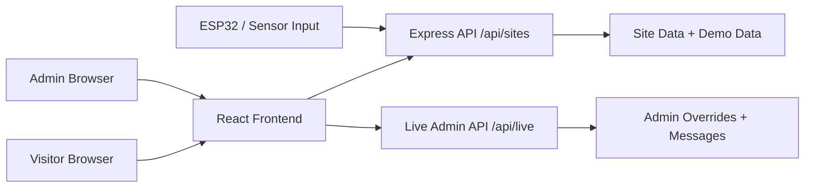

# Overall System Documentation

## 1. System overview

The Dapitan Rizal Heritage Tourism system is a full-stack web application designed to help visitors explore heritage sites in Dapitan City and understand crowd conditions before visiting. The application combines:

- a visitor-facing map and site directory
- occupancy information for each heritage site
- admin controls for adjusting crowd data and publishing notices
- route guidance and historical information for each location

The system is structured as a small tourism information platform with a React frontend and an Express backend. It is designed as a thesis prototype and can later be connected to real IoT or sensor-based visitor tracking.

## 2. System goals

The system supports three core goals:

1. Promote heritage tourism in Dapitan City
2. Show real-time or estimated crowd status at each site
3. Allow administrators to communicate visitor notices and operational updates

## 3. High-level architecture



### Main components

#### Frontend
- Built with React and Vite
- Displays the heritage map, site list, recommendations, and selected site details
- Handles both visitor mode and admin mode
- Uses Leaflet and OpenStreetMap tiles for map interaction

#### Backend: public site API
- Built with Express
- Exposes site data through `/api/sites`
- Returns occupancy, capacity, and detailed heritage information
- Supports optional ESP32-style occupancy updates through `/api/sites/:id/occupancy`

#### Backend: live admin API
- Mounted from `backend/src/live.cjs`
- Stores admin overrides and visitor messages in a JSON file
- Authenticates admin access with a bearer token
- Lets admins change site occupancy values and publish notices

## 4. Project structure

```text
Dapitan_Heritage_Tourism/
├── frontend/
│   ├── src/
│   ├── index.html
│   ├── package.json
│   └── vite.config.js
├── backend/
│   ├── src/
│   ├── package.json
│   └── live-data.json (generated at runtime)
├── docs/
│   ├── USER_GUIDE.md
│   ├── ADMIN_GUIDE.md
│   └── SYSTEM_GUIDE.md
├── package.json
├── README.md
└── .gitignore
```

## 5. Runtime flow

### Visitor flow

1. A user opens the frontend application.
2. The app loads the default heritage site list.
3. The frontend requests site data from the backend API.
4. If the backend is unavailable, the app falls back to built-in demo data.
5. The map and site panels are rendered with current occupancy values.
6. The user can search, filter, select a site, and read historical highlights.
7. The app shows route directions using browser geolocation when available.

### Admin flow

1. The admin opens the sign-in screen.
2. The app asks for a username and password.
3. The browser sends credentials to `/api/live/login`.
4. The server validates them and returns a bearer token.
5. The admin dashboard loads and allows occupancy editing and notice publishing.
6. Changes are stored as overrides and become visible to visitors.

## 6. Data model

The system mainly works with these data objects:

### Site object

Each site includes:

- `id`
- `name`
- `shortName`
- `position` (latitude, longitude)
- `address`
- `currentVisitors`
- `capacity`
- `description`
- `history`
- `highlights`
- `recommendation`

### Occupancy logic

The app calculates occupancy as a percentage:

```text
occupancy % = (currentVisitors / capacity) * 100
```

Status thresholds are:

- Low: less than 40%
- Moderate: 40% to 59%
- High: 60% and above

### Notice object

Each visitor notice contains:

- `id`
- `text`
- `siteId` or `null` for all-site notices
- `createdAt`

## 7. Backend APIs

### Public site API

#### `GET /api/health`
Returns a simple service health check.

#### `GET /api/sites`
Returns the full list of heritage sites and computed occupancy values.

#### `GET /api/sites/:id`
Returns one site by ID.

#### `POST /api/sites/:id/occupancy`
Allows external system integration for updating site visitor counts.

Example payload:

```json
{
  "currentVisitors": 25
}
```

### Live admin API

These endpoints are implemented in `backend/src/live.cjs` and are used by the admin interface.

#### `POST /api/live/login`
Signs in an administrator and returns an auth token.

#### `GET /api/live/`
Returns the current live data object, including overrides and messages.

#### `PUT /api/live/sites/:id`
Updates a site override with new visitor counts and capacity.

#### `DELETE /api/live/sites/:id`
Removes the override and returns to the default site data.

#### `POST /api/live/messages`
Creates a new notice message.

#### `DELETE /api/live/messages/:id`
Deletes a notice from the system.

## 8. Security and authentication

The admin system uses a simple bearer-token authentication pattern.

- Default prototype credentials:
  - username: `admin`
  - password: `admin123`
- The token is created on successful login.
- Protected admin actions require the token in the `Authorization` header.

This is suitable for a thesis prototype, but production deployment should use stronger safeguards, such as:

- environment-based credentials
- HTTPS
- stricter token management
- role-based access control
- secure persistent storage

## 9. Frontend behavior

The frontend is responsible for user experience and operational logic. It performs these functions:

- renders map markers for each heritage site
- shows a selected site panel with details and recommendations
- calculates the status badge from occupancy percentage
- supports filtering and searching by site name
- loads admin overrides over the base site dataset
- displays general notices and site-specific notices
- uses geolocation to estimate route directions

The app supports both offline fallback and connected-server behavior:

- If the backend is running, live data is used.
- If the backend is unavailable, the frontend reads local data.
- If the admin changes values while the server is offline, those changes stay in the browser until the backend reconnects.

## 10. Storage and persistence

The project uses a simple two-layer approach:

### Public data layer
- In-memory site objects in `backend/src/server.js`
- Optional sensor override state using `sensorOverrides`

### Admin data layer
- Stored in `backend/src/live-data.json`
- Holds:
  - site overrides
  - stored messages
- Data persists between admin sessions while the Node process remains active

## 11. Included heritage sites

The current prototype includes three main sites:

1. Rizal Shrine
2. Relief Map of Mindanao
3. Punto del Desembarco de Rizal / Rizal Landing Site

These are represented with coordinates, capacities, historical descriptions, and recommendations.

## 12. Operational notes

### Ease of use
The app is intentionally simple and works as a prototype for demonstration, classrooms, and project validation.

### Extensibility
The architecture is prepared for future enhancements, including:

- database storage instead of in-memory or JSON data
- real ESP32 sensor integration
- user authentication for full multi-user access
- analytics and reporting
- deployment to a cloud hosting environment

## 13. Troubleshooting summary

### No site data appears
- Check whether the backend is running
- Verify port 5000 is available
- Refresh the page after the server starts

### Map does not load
- Check the internet connection
- Confirm the browser can reach the tile server
- Reload the page if needed

### Admin login fails
- Confirm the credentials are correct
- Check if the backend is active
- Verify that `/api/live/login` is reachable

### Admin changes are not visible
- Check whether the app is connected to the backend
- Refresh the browser session
- Confirm the admin token is still valid

## 14. Deployment summary

To run the project locally:

```powershell
npm install
npm run install:all
npm run dev
```

Then open:

- Frontend: http://localhost:5173
- Backend API: http://localhost:5000

## 15. Summary

This system is a lightweight, student-friendly tourism management platform with two clear user groups:

- visitors who want to explore heritage locations and crowd levels
- admins who manage occupancy and publish notices

The combination of a React frontend, Express APIs, and simple local data storage makes the project easy to understand, demonstrate, and expand into a larger real-world deployment.
